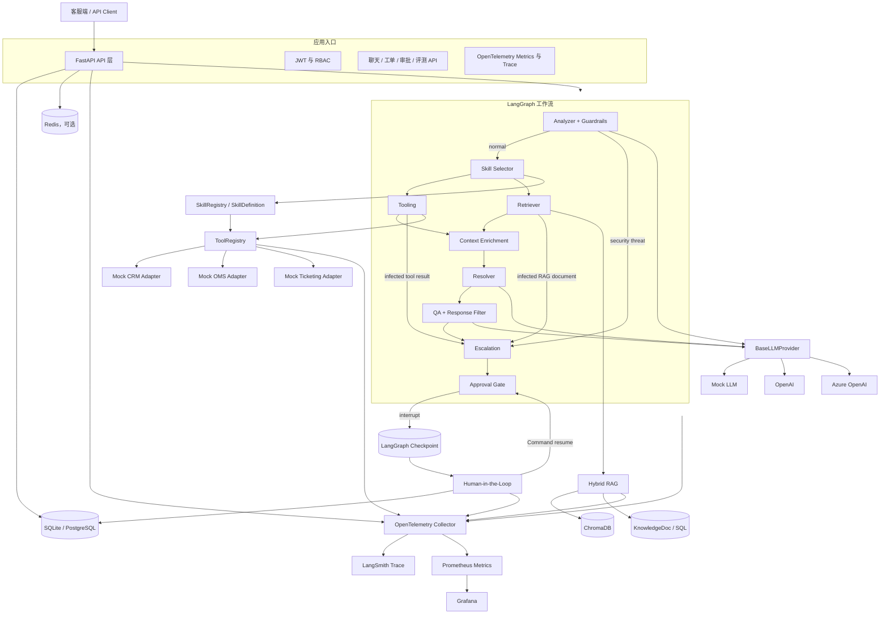
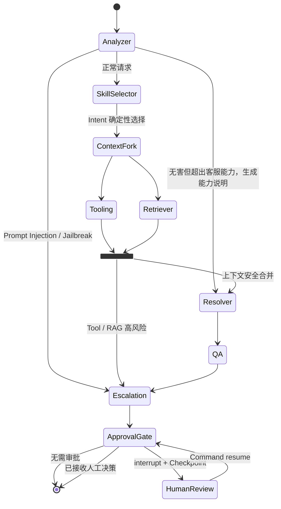
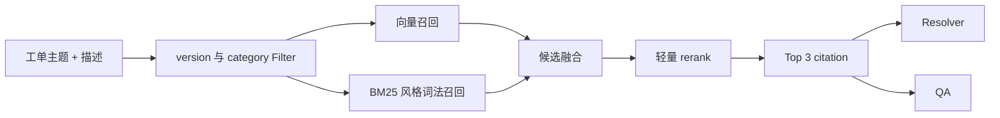
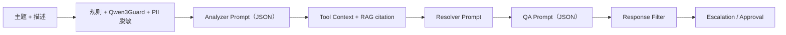
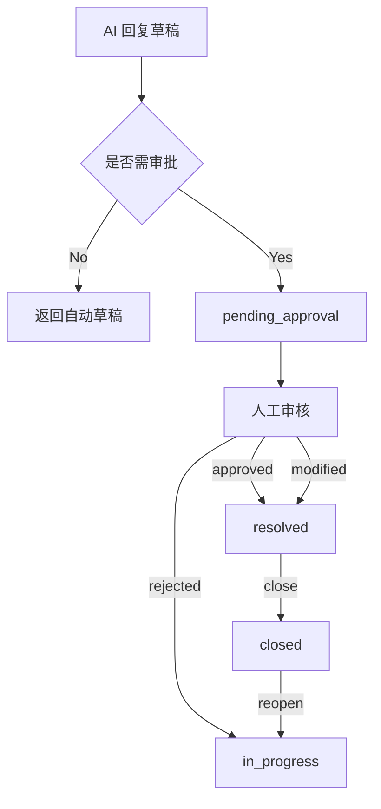
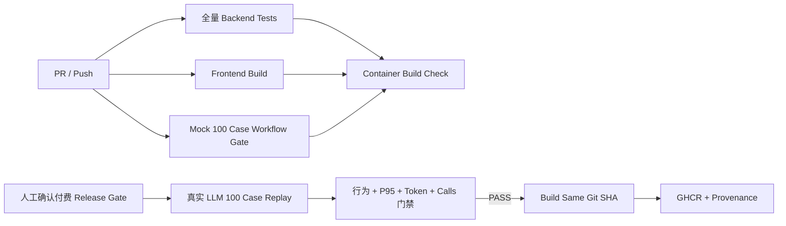

# SupportGPT 智能客服 Agent 技术架构设计

> 本文从工程实现角度说明当前系统的技术架构。它描述的是已落地的实现与明确未采用的方案，不将规划能力写成现状。项目整体背景、Mock 边界和业务流程以 `00_PROJECT_CONTEXT.md` 为准。

## 1. 架构目标与原则

系统面向售后客服工单场景，核心目标不是构建一个任意自治的通用 Agent，而是在高风险业务中提供可控、可审计、可降级的客服处理流水线。

架构遵循以下原则：

- **先安全、后生成**：Prompt Injection、Jailbreak 和 PII 处理发生在业务工具调用与 LLM 生成之前。
- **流程清晰、节点分工**：输入理解、业务信息查询、知识检索、回复生成、质量检查和转人工决定分别交给相应节点处理。
- **上下文有据可查**：回复同时使用 RAG citation 和结构化业务上下文，API 返回检索与工具审计信息。
- **高风险操作受治理**：工具统一经过 ToolRegistry，工单状态统一经过状态机，高风险回复进入 Human-in-the-Loop。
- **本地可复现、生产可替换**：Mock LLM、SQLite、可选 Redis 和本地 ChromaDB 使 Demo 可离线运行；Provider、Adapter 和部署配置保留替换空间。
- **避免虚构能力**：当前已有 Checkpoint 和审批暂停/恢复，但没有 MCP、动态 Planner、独立 TaskState 或通用分布式任务队列。

## 2. 整体架构图

### 各层分别负责什么

| 架构层 | 这一层负责什么 | 输入 | 输出 | 采用原因 | 可替代方案与权衡 |
|---|---|---|---|---|---|
| API 层 | 接收请求并校验身份，启动工作流，保存工单和审批记录，再返回结果 | HTTP 请求、JWT、会话与工单参数 | API 响应、工单与审批记录 | FastAPI 适合异步 I/O，Pydantic 用于校验请求和响应 | Django / Flask；Django 自带的管理功能更多，Flask 则需自行补上异步处理和数据校验 |
| Agent 层 | 执行客服理解、检索、生成和风控流程 | 当前工单与知识库版本 | 回复草稿、citation、工具审计、升级结论 | LangGraph 适合显式状态机式 Agent 编排 | 普通 Chain 难以表达条件路由与节点观测；工作流引擎会增加结构复杂度 |
| 工具层 | 获取结构化业务上下文并进行调用治理 | 客户标识、操作角色、工单标识 | 工具结果和审计信息 | ToolRegistry 统一权限、Schema、超时和 Mock 标记 | 直接调用 Adapter 简单但不可审计；Function Calling / MCP 尚未采用 |
| 知识层 | 管理知识文档、版本、检索与 citation | 查询、版本、类别 | Top-K citation | Hybrid RAG 兼顾语义与精确词匹配 | 纯向量检索较简单但对规则编号、时间窗口和产品词不稳定 |
| 数据层 | 保存用户、工单、会话、文档和审批数据 | 领域实体 | 事务性持久化记录 | SQLAlchemy Async 同时兼容 SQLite 与 PostgreSQL | 纯 NoSQL 模式更灵活但不利于工单状态和审批事务约束 |
| 可观测层 | 统一采集全局指标和单次调用路径 | 请求、节点、工具、检索、审批事件 | OTel Trace / Metrics，经 Collector 转发 LangSmith 与 Prometheus | Metrics 看趋势、Trace 定位单次慢点 | Collector 增加一层运维成本，但消除了应用双轨采集 |

## 3. LangGraph Workflow

### 3.1 工作流图

### 3.2 节点编排

| 节点 | 这个节点负责什么 | 输入 | 输出 | 设计原因 | 可替代方案 | 当前做法 |
|---|---|---|---|---|---|---|
| Analyzer | 规则与 Qwen3Guard 语义安全检测、PII 脱敏、情绪/优先级/部门/意图分类和初始风险评估 | 主题、描述 | 分类结果、置信度、脱敏文本、语义安全结果或安全阻断 | 在早期阻断风险，减少越权工具和无效 LLM 调用 | 只用规则、只用专用分类模型 | 固定高置信度意图优先规则分类，模糊/多意图才调用精简 LLM Schema |
| Skill Selector | 根据 Intent 选择有版本的 Skill，并确定可用 Tool、RAG 类别和必填信息 | Analyzer State | Skill 名称、版本、Registry Hash、Policy 快照 | 把业务选择规则和 Graph 节点分开，并防止 LLM 选择高风险能力 | LLM Router、每 Skill 独立 Subgraph | V1 根据 Intent 选择 Skill，所有 Skill 共用 Workflow，避免增加调用成本和误路由 |
| Context Enrichment | 并行执行 Tooling 与 Retriever，以风险只升不降策略合并 State | Skill Selector State | Tool Context、citation、联合风险结果 | 两分支无强依赖，并行可降低等待时间 | LangGraph 串行节点 | 并行分支后集中合并，任一分支高风险都清空上下文并转人工 |
| Tooling | 补充客户、订单、历史工单上下文，检查工具结果的间接注入 | 客户 ID、角色、部门、意图 | `tool_context`、`tool_calls` 或安全阻断 | 先补齐业务事实，但不信任外部工具文本 | 让 LLM 自行决定工具 | 确定性调用后执行规则 + Qwen3Guard 扫描；语义服务不可用时隔离未扫描的 Tool Context |
| Retriever | 召回售后政策、FAQ 和操作指引，检查文档间接注入 | 工单主题、描述、版本、类别 | citation 列表或安全阻断 | 给回复提供知识依据，且不把受污染文档交给模型 | 纯关键字搜索、纯向量搜索 | 混合检索后执行规则 + Qwen3Guard 扫描；语义服务不可用时隔离 citation |
| Resolver | 合并检索与业务上下文生成客服草稿 | 工单、Top-2 citation、必要 Tool Context | `suggested_response` | 将业务事实与知识事实统一供给模型 | 模板化回复、全量上下文 | 限制 Context 和 max_tokens，只生成最终客服回复 |
| QA | 评估回复质量和幻觉风险，过滤内部信息泄露 | 问题、精简 citation、草稿 | score、幻觉和 citation 验证标记 | 生成后再加一道独立风险门 | Resolver 自检、人工全量审核 | 确定性失败优先规则，其余使用可单独配置的轻量 Judge Model |
| Escalation | 调用 Risk Engine、计算 SLA 并决定是否升级 | 安全、优先级、情绪、意图、置信度、QA、幻觉、错误 | 风险等级/分数/原因、升级结论、SLA | 将风险策略与生成逻辑解耦 | 在 Prompt 内决定、分散 if/else | 独立确定性规则更可审计、可测试并可统一调阈值 |
| Approval Gate | 对需审批回复执行 interrupt，接收人工决策后续跑 | 风险、QA、升级结论或 Command resume payload | 暂停的 Checkpoint，或带人工决策的终态 State | 把人工审批变成 Graph 内不可绕过的关卡 | Graph 外另建审批记录、从头重跑 | 保留已完成节点结果并支持跨重启恢复；代价是状态兼容、租约和清理治理 |

### 3.3 设计原因

当前流程是**固定有向图**，而不是由 LLM 在运行时自由选择任意步骤。售后场景中，安全检查、上下文补全、检索、QA 和审批都有确定的治理要求。固定图牺牲了一部分通用自治能力，但换来更低的行为不确定性、更清晰的故障定位和更稳定的测试边界。

## 4. State 设计

### 4.1 AgentState

当前 LangGraph 共享状态是 `AgentState`。它是工作流内唯一的任务状态对象，承载一次工单处理从输入到结果的上下文。

| 状态分组 | 关键内容 | 输入来源 | 下游消费者 | 设计原因 |
|---|---|---|---|---|
| 工单标识 | 工单 ID、客户 ID、主题、描述、知识库版本 | API | 全部节点 | 保证所有结果可关联到具体请求和知识版本 |
| 分类结果 | 情绪、优先级、意图、部门、Analyzer 置信度 | Analyzer | Tooling、Retriever、Risk Engine | 决定订单查询、类别过滤、SLA 和初始风险 |
| Skill 快照 | 名称、版本、选择策略、Registry Hash、槽位、Tool/RAG 边界 | Skill Selector | ToolRegistry、Checkpoint、Trace、AgentRun、Evaluation | 让能力选择可复现、可审计、可回放 |
| 安全与风险 | 安全威胁、检测分数与信号、风险等级/分数/原因、人工与自动化建议 | Guardrails、Analyzer、QA、Risk Engine | 条件边、Escalation、Approval、API、Trace | 让所有节点使用同一风险语义，避免分散阈值漂移 |
| 工具上下文 | 操作角色、结构化 Tool Context、调用审计 | Tooling / ToolRegistry | Resolver、API、Trace | 让回复可利用业务事实并暴露治理证据 |
| RAG 结果 | citation | Retriever | Resolver、QA、API | 让回答、质量判断和人工核验使用同一依据 |
| 生成证据 | `resolution_evidence`：必要 Tool 事实、Top-2 KB 引用和有界会话内容 | Resolver 调用模型前 | QA、Checkpointer | QA 直接复用生成时使用的证据，避免物流事实等关键数据在二次拼装时丢失 |
| 生成与质量 | 回复草稿、QA 分数、幻觉标记 | Resolver、QA | Escalation、Approval、API | 将内容生成和风险判断分离 |
| 处理决定 | 是否转人工、转人原因、是否需审批 | Escalation | Approval、API | 让工作流判断能否自动回复，以及是继续还是等待审批 |
| 持久执行 | Thread ID、逻辑 Namespace、执行状态、审批状态和人工决策 | API、Approval Gate | Checkpointer、恢复服务、API | 让同一 Graph 可以跨请求、跨重启继续 |
| 可观测数据 | token、成本、延迟、错误列表 | 各节点 | Metrics、Trace、API | 支持成本控制、排障和安全短路 |

`AgentState.intent` 使用统一 `IntentType`，规则表、OpenAI-compatible/Azure Prompt、Mock Provider、Tooling、Risk Engine 和 Agent Evaluation 共用同一套 8 个枚举值。Provider 不遵守约束时，未知值会归一化为 `information_request`，同时将分类置信度上限降至 `0.5`，使 Risk Engine 触发受控人工处理。

Resolver 与 QA 共用 `src/agents/evidence.py` 的证据构造器。Resolver 在现有安全扫描之后只构造一次证据，保存为 State 中的字符串列表，再把相同内容传给生成模型。QA 直接读取这个列表，规则校验也从列表中解析 Tool JSON 和 citation，不另取后来更新的 Tool / KB 内容。旧 State 缺少该字段时才重新构造，保持历史 Checkpoint 兼容。Jev 出站前仍会过滤敏感字段，但同一业务 ID 在问题、证据、回答和 Trace 中使用同一个别名；状态、异常、下一步和引用编号不会因此丢失。

`src/agents/scope.py` 处理明确的客服能力范围外请求。Analyzer 在安全检查后用规则或现有 Jev 分类结果标记范围，当前轮不使用无关历史实体。Graph 只增加 Analyzer 到现有 Resolver 的条件边；Resolver 生成不含外部事实的能力说明，QA 验证后仍经过 Escalation 和 Approval Gate。没有新增节点或服务，也不修改风险阈值。Trace 保存范围、判断方式、回复类型和最终完成状态。

**这个状态用来做什么**：在节点之间传递结构化的上下文，并保留必要信息供审计。

**输入**：API 构建的当前工单信息与默认值。

**输出**：工作流结束时的聚合处理结果。

**采用原因**：TypedDict 结构轻量，适合 LangGraph 的显式状态更新模型。

**可替代方案**：Pydantic State、dataclass、事件流或持久化状态存储。Pydantic 可提供更强校验，但会增加节点更新时的序列化与兼容复杂度。
**工程权衡**：State 已由 LangGraph Checkpointer 跨请求持久化，并可在审批后恢复；当前仍缺少 Checkpoint TTL/归档、历史 Graph 版本兼容和 Alembic 管理的业务表迁移。

### 4.2 TaskState

当前项目**没有独立的 `TaskState`**。任务输入、执行中的上下文和最终结果都保存在 `AgentState` 中。

| 项目 | 当前结论 |
|---|---|
| 单独对象的工作 | 目前不适用；系统没有单独保存任务计划或子任务的对象 |
| 输入/输出 | 不适用；由 `AgentState` 统一承载 |
| 未采用原因 | 当前客服流程为固定图；持久恢复只需要保存单一 AgentState，不需要动态子任务计划对象 |
| 可替代方案 | 将工单任务、子任务、计划版本、重试计数和执行状态拆为 `TaskState` |
| 工程权衡 | 独立 TaskState 更适合动态 Planner 和多子任务编排；当前引入会增加状态同步、Schema 演进和恢复兼容成本 |

如果未来引入动态 Planner、多步骤调查或异步任务队列，再将 `AgentState` 拆分为 `TaskState + ExecutionState`。在此之前，不得在 API、文档或对外介绍中声称已有 `TaskState`。

## 5. Agent 编排、Planner 与 Selector

### 5.1 Agent 编排

当前 Agent 编排由 LangGraph 固定定义：正常请求走 Analyzer → Skill Selector → Tooling/Retriever 并行 → Context Enrichment 合并 → Resolver → QA → Escalation → Approval Gate；用户输入、Tool 结果或 RAG 文档任一信任边界命中安全风险时，直接路由到 Escalation，再由 Approval Gate 强制暂停等待人工处理。

**工作方式**：按照固定顺序调用节点，遇到指定条件时转入相应分支。

**输入**：`AgentState`。

**输出**：已补充上下文、已生成、已校验并已完成升级决策的 `AgentState`。

**设计原因**：客服问题的处理阶段相对稳定，显式编排能够把安全和审批设为不可绕过的关卡。

**可替代方案**：ReAct 循环、动态 DAG、Multi-Agent 协商、任务队列编排。
**最终取舍**：采用固定图，避免 LLM 自主跳过 QA、无限循环或执行未授权动作。

### 5.2 Planner

当前项目**没有独立 Planner Agent**。规划发生在两个层面：

1. 设计时已确定标准处理路径和安全短路路径。
2. 运行时 Analyzer 产出的部门、意图、优先级用于决定订单查询、RAG 类别过滤、SLA 和升级规则。

处理顺序由固定 Workflow 决定，系统根据意图分类结果选择后续分支。LLM 不会自行列出步骤、拆分子任务或生成动态执行计划。

| 维度 | 当前方案 | 可替代方案 | 最终原因与权衡 |
|---|---|---|---|
| 如何决定步骤 | 按既定 Workflow 和分类结果选择处理路径 | LLM Planner 动态生成多步计划 | 客服流程稳定且风险高，固定路径更容易控制 |
| 输入 | 当前工单、分类结果、安全结果 | 工单、历史、工具目录、环境状态 | 动态 Planner 需要更强验证与恢复机制 |
| 输出 | 固定节点路径或安全短路路径 | 计划列表、子任务、依赖关系 | 当前输出更易测试；灵活性较低 |
| 重新规划 | 仅有 RAG 类别回退和人工拒绝后的重新处理 | Plan Revision、反思式重规划 | 当前没有自主 Replanning，避免不可控循环 |

### 5.3 Selector 与 Skill Framework

当前项目已有不调用 LLM 的 `Skill Selector` 控制节点。它在 Analyzer 后将 8 个统一 Intent 映射到 6 个 Skill：`refund_support`、`order_support`、`account_support`、`api_incident_triage`、`warranty_support`、`general_support`。

- 安全路由选择：客户输入、Tool 返回或 RAG 文档命中 Prompt Injection，或输入命中 Jailbreak 时直接进入 Escalation。
- Skill 选择：使用 `IntentType -> SkillDefinition` 唯一索引，不接受 LLM 自由路由。
- Tool 选择：Skill 定义 Allowlist/Forbidden List，ToolRegistry 在 Schema、RBAC 和高风险审批之前额外校验 Skill 版本与权限。
- 检索范围选择：优先按部门类别检索；为空时放宽类别过滤。
- 升级选择：由 Risk Engine 综合安全、优先级、情绪、高风险业务意图、分类置信度、QA、幻觉和异常信号决定。

**它负责的工作**：依据安全和分类结果选择 Skill、Tool 和 RAG 范围，并记录选择依据。

**输入**：安全结果、分类结果、当前上下文。

**输出**：Skill 名称/版本、Registry Hash、必填但缺失的信息，以及这类请求可以使用的 Tool 和 RAG 知识类别。

**设计原因**：这些选择直接影响权限、成本和客户体验，使用确定性规则可减少 LLM 误选。

**可替代方案**：LLM Router、策略模型、每 Skill 独立 LangGraph Subgraph。
**工程取舍**：V1 所有 Skill 共用现有 Workflow，尚未通过独立 Subgraph 隔开各自的运行路径。系统可以重现地查看选择结果、版本、权限和评测信息，而且不会改动现有业务流程。

## 6. Reviewer、Validator 与 Reflection

### 6.1 Reviewer

当前 Reviewer 角色由 QA 节点承担。

| 维度 | 说明 |
|---|---|
| 检查内容 | 确认回复有没有 citation 支持，是否可能有幻觉，以及是否泄露内部指令或工作流信息 |
| 输入 | 原始问题、检索 citation、回复草稿 |
| 输出 | QA 分数、幻觉标记、风险原因和过滤后的回复 |
| 设计原因 | 将“生成”与“审查”分离，避免同一阶段既生成又自我放行 |
| 可替代方案 | 规则校验、Cross-encoder、独立 Judge Model、人工全量审核 |
| 最终取舍 | 使用 Provider QA + Response Filter；实现轻量，但 QA 质量随模型和上下文质量变化 |

### 6.2 Validator

当前系统没有名为 Validator 的单一 Agent，而是采用分层验证：

| 验证层 | 验证内容 | 输入 | 输出 | 设计原因 |
|---|---|---|---|---|
| 输入安全验证 | 确定性规则、Qwen3Guard 语义分类、Jailbreak、PII | 主题与描述 | 结构化安全结果、安全短路或脱敏文本 | 风险输入不得进入工具和生成环节 |
| 外部上下文验证 | 规则 + Qwen3Guard 检测间接 Prompt Injection | Tool 返回、RAG citation | 可信上下文、安全短路或隔离 | 外部系统与知识文档不能被当作指令来源 |
| 风险验证 | 统一 Risk Engine | 安全、业务、置信度、QA、错误 | 风险分数/等级/原因与处置建议 | 避免多节点各自维护不一致阈值 |
| 工具验证 | Pydantic Schema、RBAC、超时 | 工具名、参数、角色 | 成功、拒绝、校验错误、超时或错误审计 | 防止错误参数与越权调用 |
| 检索验证 | 版本与类别过滤、citation 返回 | 查询与过滤条件 | 有版本归属的检索结果 | 减少跨版本知识污染 |
| 输出验证 | QA、幻觉判断、Response Filter | 草稿与检索上下文 | 评分、风险标记、过滤结果 | 减少无依据回答和内部提示泄露 |
| 状态验证 | 合法状态转移 | 工单当前状态与动作 | 新状态或 `409 Conflict` | 避免审批前关闭等非法业务操作 |

最终采用“多层 Validator”而非一个总 Validator，是因为安全、权限、内容质量和状态机的失败语义不同，分层处理更利于定位和审计。

### 6.3 Reflection

当前项目**没有独立 Reflection Loop**。QA 是一次性 Review，不会把低分草稿自动送回 Resolver 反复改写。

| 项目 | 当前结论 |
|---|---|
| 当前做法 | 本项目没有这项能力；系统不会在模型自我反思后自动重写回复 |
| 未采用原因 | 客服政策场景中，自动多轮改写可能放大错误、增加成本并延迟人工介入 |
| 当前替代机制 | QA 低分或幻觉时升级到 Human-in-the-Loop |
| 可替代方案 | 限次 Reflection，例如“引用不足时最多重写一次” |
| 工程权衡 | Reflection 可能提升措辞质量，但需要严格的次数上限、幂等规则、质量比较和成本预算 |

## 7. Tool Calling 与 MCP

### 7.1 Tool Calling

Tool Calling 通过 ToolRegistry 实现，所有业务工具都必须从该入口调用。

| 维度 | 说明 |
|---|---|
| 它管什么 | 集中管理工具可接收的参数、使用者权限、超时限制、Mock 状态和审计记录 |
| 输入 | 工具名称、结构化参数、调用角色、工单 ID |
| 输出 | 工具结果及包含允许状态、执行状态、耗时、错误、Mock 标记的审计记录 |
| 当前工具 | 客户画像、订单历史、历史工单、退款资格初筛、创建 Mock 退款请求 |
| 调用策略 | 正常工作流中始终读取客户画像和历史工单；仅相关部门或意图读取订单；退款资格初筛为 manager 级工具，当前主流程不会自动调用 |
| 设计原因 | 客服上下文需要结构化事实，且退款等能力不能由 LLM 无约束触发 |
| 可替代方案 | OpenAI Function Calling、JSON-RPC、gRPC、直接 HTTP Client、MCP |
| 最终取舍 | 本地 Registry 依赖少、可测试、适合 Mock；调用审计已持久化，但工具发现仍是单进程静态注册 |

### 7.2 高风险 Action 状态机与持久化审计

| 维度 | 当前设计 |
|---|---|
| 它怎么保护写操作 | Agent 不能自动调用高风险写 Tool；操作要先提议、审批，再异步执行。结果不明时先对账，需要时补偿，并保留完整审计记录 |
| 输入 | Ticket、Tool 名、结构化 payload、intent、当前用户与 expected version |
| 输出 | `ToolAction`、`ToolActionControl`、Append-only `ToolActionEvent`、`ToolOutboxEvent`、`ToolInvocationAudit` 和脱敏 API 视图 |
| 设计原因 | 资金类写操作不能因 LLM 错误路由、重放或审批绕过直接产生副作用 |
| 可替代方案 | 仅 RBAC、通用审批表、消息队列 Saga、外部 Workflow Engine |
| 最终选择 | V2.2 使用确定性状态机与 Transactional Outbox；主路径为 `proposed -> pending_approval -> approved -> queued -> executing -> succeeded/failed/unknown`，`unknown` 只能进入 `reconciling`，已成功动作可显式进入补偿状态机 |
| 工程权衡 | 参数使用 Fernet 加密，payload 与 Policy 快照使用 HMAC 防篡改；每个写 Action 生成业务幂等键。API 事务原子写入 `queued + Outbox`，Worker 用租约和 `version` 条件更新竞争消费。Retry Queue 与 DLQ 复用 Outbox 状态，减少组件数量；当前 OMS 仍为 Mock，DDL 仍依赖 `create_all`，不等同于真实跨系统 exactly-once |

V2.2 把“命令投递成功”和“外部业务执行成功”明确分开。Worker 在调用外部系统前先持久化 `executing`；若调用超时或 Worker 中断，Action 进入 `unknown`，后续只调用 `reconciliation_handler(idempotency_key)` 查询权威结果。对账确认成功或失败后补写状态事件；结果仍未确定时对账事件指数退避，达到上限进入 DLQ 并标记人工处理。补偿由主管显式发起，使用独立 `compensation_key`，同样不允许绕过状态机。

Policy 在 Action 创建时冻结版本、Tool 版本、角色、风险、允许意图、审批与幂等约束，并保存 HMAC。审计回放读取历史快照进行 deterministic 校验，不使用当前配置重写历史结论。

### 7.3 MCP

当前项目**没有集成 MCP（Model Context Protocol）**，因此不存在任何运行时 MCP Client、MCP Server、MCP Tool、MCP Resource 或 MCP Prompt 调用。

| 维度 | 当前结论 |
|---|---|
| 当前做法 | 未接入 MCP；外部企业工具目前用本地 ToolRegistry 和 Mock Adapter 模拟 |
| 输入/输出 | 不适用 |
| 未采用原因 | 目前主要是在本地重现客服处理流程，尚无跨工具宿主的标准化接入需求 |
| 可替代方案 | 未来将 CRM、OMS、工单、知识库等封装为 MCP Server，再由受限 MCP Client 调用 |
| 工程权衡 | MCP 有利于标准化集成和工具复用，但会引入连接鉴权、服务发现、资源治理、协议版本和审计边界；在真实外部服务需求明确前不提前引入 |

如果未来接入 MCP，仍需保留权限检查、参数校验、超时限制、审计和高风险审批。MCP 工具也必须通过 ToolRegistry 检查后才能执行。

## 8. Memory 与 Checkpoint

### 8.1 Memory

系统已实现 Memory V1，采用“SQL 结构化事实源 + Redis 可选 revision Cache + 有界 Context Assembly”。

| 维度 | 说明 |
|---|---|
| 它怎么工作 | 先检查 session/customer 是否匹配，再保存新消息，组装经过安全处理、可供 Agent 使用的上下文 |
| 输入 | `session_id`、`customer_id`、当前消息、Ticket/审批关联 |
| 输出 | `recent_turns`、`summary`、`active_entities`、上一轮 Intent/Department、Memory version/source |
| Redis 策略 | 缓存最近 final 消息，TTL 24 小时；Cache 必须与 SQL revision 一致，否则直接回退 SQL |
| SQL 策略 | `ConversationSession`、`ConversationMessage`、`ConversationMemorySnapshot` 为事实源；旧 `SessionMemory` 仅用于首读兼容迁移 |
| 上下文策略 | 最近 12 条、默认 4000 字符预算；历史重新脱敏和 Injection 扫描，pending/rejected 草稿不进入 Prompt |
| 节点消费 | Analyzer 用于显式指代和意图延续；Retriever 只取历史 User 问题和实体；Resolver 注入带信任边界的上下文；QA 使用已解析实体 |
| 设计原因 | SQL 保证耐久和审计，Redis 降低热会话读取成本，有界组装控制 Token 和历史污染 |
| 可替代方案 | 仅 SQL、仅 Redis、向量化长期记忆、事件流存储 |
| 最终取舍 | V1 优先可预测的短期/结构化 Memory，不提前引入向量长期记忆 |

**重要限制**：当前摘要和实体提取是确定性 V1，仅识别显式订单/运单标识；没有长期语义召回、用户偏好学习、独立多轮评测门禁或真实终端用户身份体系。Checkpoint 仍与用户 Memory 分离。

### 8.2 Checkpoint

当前项目已经使用 LangGraph Checkpointer 和业务侧 AgentExecution 实现第一版 Durable Execution。FastAPI 启动时初始化 Saver：本地使用独立 AsyncSqliteSaver，PostgreSQL 环境默认复用 DATABASE_URL 并使用 AsyncPostgresSaver；测试或显式关闭时使用 MemorySaver。

| 维度 | 当前设计 |
|---|---|
| 它怎么工作 | 在节点之间保存 AgentState；需要审批时在 Approval Gate 暂停，并在人工决定后从原 Thread 继续 |
| 输入 | 稳定 UUID thread_id、根 Graph 空 checkpoint namespace、当前 State 或 Command(resume) 人工决策 |
| 输出 | LangGraph Checkpoint、StateSnapshot、暂停节点、Checkpoint ID 和恢复后的终态 State |
| 业务关联 | AgentExecution 关联 Ticket、ResponseApproval、AgentRun、Request ID、初始/恢复 Trace ID 和 Workflow Version |
| 防重复恢复 | 数据库原子 UPDATE 抢占有时限的恢复租约；已完成执行再次调用时直接返回，不重复运行 |
| 重启恢复 | 启动扫描“人工已决策但 Graph 未完成”的记录；主管也可调用恢复 API 重试 |
| 设计原因 | 人工审批可能跨分钟或跨进程，不能占用 HTTP 请求，也不能在审批后重新调用前置 LLM、RAG 和 Tool |
| 可替代方案 | Redis Saver、从头重跑、Celery/消息队列、Temporal/Camunda |
| 最终取舍 | 使用官方 SQLite/PostgreSQL Saver 保持本地可复现与生产耐久性；业务表只保存关联、状态和租约，不复制 Checkpoint 正文 |
| 工程权衡 | 已覆盖审批等待和幂等恢复，但尚无 TTL/归档、旧 Graph 版本兼容、通用任务队列和全节点自动续跑；AgentExecution 及 Saver DDL 仍未纳入 Alembic |

## 9. RAG、Hybrid Search 与向量数据库

### 9.1 RAG 流程

| 模块 | 这个模块做什么 | 输入 | 输出 | 设计原因 | 可替代方案 | 最终做法 |
|---|---|---|---|---|---|---|
| 文档解析与分块 | 将 PDF、DOCX、HTML、TXT、Markdown、FAQ 转为可检索 chunk | 原始知识文档 | 文本 chunk 与 metadata | 控制上下文粒度并保留语义连续性 | 固定长度切块、语义切块 | 当前递归切分易实现，复杂文档结构理解有限 |
| 向量数据库 | 持久化 Embedding 与 chunk metadata | chunk、Embedding、版本、类别 | 向量候选 | 本地 Demo 低门槛、支持 metadata filter | pgvector、Pinecone、Milvus、OpenSearch | 采用 ChromaDB，运维简单；横向扩展和生产检索治理能力较弱 |
| Vector Search | 召回语义相近内容 | Query Embedding、过滤条件 | 向量候选及相似度 | 处理同义表达和自然语言变体 | 纯 BM25 | 纯向量无法稳定命中精确政策词 |
| Lexical Search | 进行进程内 BM25 风格打分 | Query token、过滤后的文档 | 词法候选 | 强化订单词、时间窗口、政策短语 | Elasticsearch/OpenSearch BM25、PostgreSQL FTS | 本地实现无外部依赖；不适合大规模索引 |
| Rerank | 融合向量、词法和精确词重合 | 两类候选 | 最终排序 | 降低单一检索信号偏差 | Cross-encoder、LLM rerank | 轻量规则延迟低；语义精度低于训练型 Reranker |
| Citation | 返回来源、片段、分数、版本 | Top-K 结果 | 可核验引用 | 支撑回复、QA 与人工审核 | 仅返回文本 | citation 增加可解释性，但不等于自动事实正确 |

### 9.2 Hybrid Search 评分取舍

最终排序将向量相似度、归一化词法分数和精确词重合增益结合。它的目标是改善退款期限、产品名、订单标识和政策短语这类精确规则查询。

当前选择进程内 Hybrid Search 的原因是本地可运行、依赖较轻、可直接配合 ChromaDB Metadata Filter。代价是词法召回需要读取过滤范围内的文档，规模扩大后会出现延迟和内存压力。生产化方向是抽象 `SearchBackend`，保留本地 Chroma 方案并设计 OpenSearch 等后端。

## 10. Prompt Pipeline

| 阶段 | 这一步要做什么 | 输入 | 输出 | 设计原因 | 可替代方案 | 当前做法 |
|---|---|---|---|---|---|---|
| 输入 Guardrails | 阻断攻击、脱敏 PII | 原始主题和描述 | 结构化安全结果或脱敏文本 | 防止不可信输入进入后续链路 | 只用规则、只用模型、人工初筛 | 规则先拦截确定性特征；PII 脱敏后由 Qwen3Guard-Gen-0.6B 识别语义变体，Risk Engine 融合结果 |
| 上下文 Guardrails | 阻断间接 Prompt Injection | Tool 结果、RAG 文档 | 可信上下文、安全短路或隔离 | 防止受污染的外部数据改写模型任务 | 内容签名、沙箱摘要、人工审查 | 敏感业务字段过滤后执行规则 + Qwen3Guard；语义服务失效时不将未扫描内容交给业务 LLM |
| Analyzer Prompt | 模糊或多意图工单分类 | 脱敏工单 | 五个必要分类字段 | 高置信度规则未命中时才产生 LLM 成本 | 全量 LLM 分类 | 精简 JSON Schema 并限制 max_tokens |
| Resolver Prompt | 基于事实与知识生成草稿 | 工单、Top-2 citation、精简 Tool Context | 最终客服回复 | 强制让生成依赖可见上下文 | 全量上下文 | 限长与 max_tokens 同时降低输入和生成成本 |
| QA Prompt | 检查回复有没有依据、是否存在幻觉 | 问题、Top-2 citation、草稿 | score / hallucination / citation JSON | 让独立的 QA 步骤在回复生成后检查质量 | 长文 Judge | 确定失败由规则短路，其他情况用轻量结构化 Judge |
| 输出过滤 | 删除内部信息泄露 | 草稿 | 过滤后的回复和风险标记 | 防止提示词与工作流暴露 | DLP 服务、关键词规则 | 当前规则简单，需持续维护覆盖面 |

PromptOps / EvalOps V1 使用文件型内容寻址 Registry。`PromptBundle` 校验 Analyzer / Resolver / QA 的变量契约并冻结内容；OpenAI-compatible / Azure 渲染同一 Bundle，Mock 保持确定性行为。`ContextVar` 在 Workflow 与整个 Baseline 实验入口固定版本，并行节点继承该版本。AgentState 保存 Bundle Hash，Checkpoint 随 State 保留该标识；AgentRun、LLM/Workflow Span 和实验报告关联同一 Hash。

`scripts/promptops.py evaluate` 隔离 SQLite/Chroma，按相同固定 100 条数据先回放当前版本、再回放候选，复用原确定性指标、Diff 和 Quality Gate。实验目录保留两份完整报告、Policy 快照、内容 Hash 和 Git 工作树指纹。晋级时重新计算门禁并核对证据；production 只接受同一干净 Git Revision 的真实模型对比，拒绝新增 FAIL Case。环境指针通过文件锁与原子替换发布，CAS 防止过时实验覆盖较新版本，回滚只允许返回已发布历史的前一版本。

V1 权限边界为受信任的本地 CLI / 发布目录写权限，适合单机与统一发布目录；没有分布式 Registry、公共管理 API、线上 A/B、自动回滚或独立语义质量发布认证。默认实验关闭外部遥测但保留本地 Trace 同源性能采集。文件 Hash 用于完整性检查，不替代签名制品与访问控制。

## 11. Redis、PostgreSQL 与数据持久化

### 11.1 Redis

Redis 是可选组件，不是启动前提。

- **用途**：缓存最近的会话消息，减少从 SQL 重复读取历史的次数。
- **输入**：会话标识和消息列表。
- **输出**：与 SQL revision 匹配的最近 final 消息；无 Redis、Cache Miss、版本落后或读取失败时回退 SQL。
- **设计原因**：短期状态对延迟敏感，且不应让缓存故障阻断客服流程。
- **可替代方案**：仅 SQL、内存缓存、Memcached。
- **最终取舍**：采用 Redis + SQL，换取性能与耐久性；引入了缓存与数据库可能短暂不一致的复杂性。

### 11.2 PostgreSQL / SQLite

| 维度 | SQLite | PostgreSQL |
|---|---|---|
| 当前定位 | 本地默认数据库 | Docker Compose 与生产风格部署数据库 |
| 适用场景 | 低门槛启动和单机 Demo | 并发事务、连接池和更接近生产的持久化 |
| 保存内容 | 用户、工单、会话、知识文档、审批 | 同左 |
| 设计原因 | 无额外服务依赖 | 适合多连接和容器化部署 |
| 工程权衡 | 并发与运维能力有限 | 需要独立服务、连接管理与迁移治理 |

数据库访问采用异步 SQLAlchemy。PostgreSQL 连接配置了连接池、连接回收和预检查；请求异常时数据库会回滚事务。当前尚未引入 schema migration 工具、读写分离或分库分表。

## 12. Error Recovery

当前由 `src/resilience/` 统一实现超时、故障分类、有界 Retry、进程内 Circuit Breaker、Fallback 与降级事件。核心原则仍是“有界恢复、安全降级、人工接管”，不做无限重试。

| 故障类型 | 当前处理 | 设计原因 | 未采用方案与权衡 |
|---|---|---|---|
| 用户输入 Prompt Injection / Jailbreak | Analyzer 安全短路至 Escalation，跳过工具、RAG、生成和 QA | 攻击输入不应继续消耗外部资源或访问业务数据 | 继续生成拒绝解释会增大提示泄露和绕过风险 |
| Tool / RAG 间接 Prompt Injection | 清空受污染上下文，从 Tooling 或 Retriever 直接进入 Escalation | 外部文本只能被视为数据，不能成为生成指令 | 完全信任 Adapter 或知识库会使间接注入穿过输入防线 |
| Qwen3Guard 不可用或输出无法解析 | 输入边界保留确定性规则并标记降级转人工；Tool / RAG 边界隔离未扫描上下文 | 语义安全服务失败不得阻断主请求，也不得默认信任外部内容 | 对所有请求 fail-closed 会导致服务大面积不可用 |
| Redis 不可用 | 自动读取 SQL 历史，保存 Redis 失败不阻断主流程 | 缓存不能成为业务单点 | 强制 Redis 高可用成本不适合本地 Demo |
| RAG 单路失败或类别无结果 | 向量路与词法路独立恢复，单路失败仍可用另一路候选；类别零召回时保留版本并放宽类别一次 | 避免 Embedding / Vector DB 成为单点，同时不破坏版本隔离 | 未引入外部搜索集群或持久化召回缓存 |
| 工具超时或瞬时故障 | 低风险读 Tool 最多有界重试；高风险写 Tool 由 Outbox 单次投递，使用业务幂等键；超时转 `unknown` 并自动查询外部权威结果 | 平衡瞬时恢复与重复副作用风险 | `asyncio.to_thread` 超时不能强制终止线程，因此结果未知时绝不直接重试写入 |
| LLM 超时、限流或 5xx | 禁用 SDK 隐式重试，统一有界 Retry；可选切换 `LLM_FALLBACK_*` 备用模型；仍失败时输出同语言安全提示并转人工 | 重试次数、成本和故障分类可观测 | 备用模型需独立配置，不保证不同模型回复完全一致 |
| Jev 超时、不可用、低置信度或非法响应 | DecisionProvider 记录降级结果，Analyzer/QA 回退原有 LLM | 决策加速层不应成为主流程单点 | 不对低置信度结果自动放行；暂不用作离线 Judge |
| QA 错误 | 将回复标记为低分与潜在幻觉 | 失败时采取保守策略，推动审批 | 自动放行会放大未知风险 |
| 非法状态流转 | 返回 `409 Conflict` 并保持原状态 | 防止审批前关闭等业务错误 | 直接覆盖状态简单但不可审计、不可控 |
| 数据库异常 | 请求事务回滚；高风险执行命令与 Action 状态通过 Transactional Outbox 原子落库 | 避免“状态已批但命令丢失” | 当前仅治理写 Tool 具备 Outbox/补偿契约，不是通用 Saga 平台 |

**Retry 边界**：LLM、RAG 和低风险读 Tool 只对 `timeout / rate_limit / connection / server_error` 做有界 Retry。高风险写调用自身始终单次，只有幂等的“结果查询”进入 Outbox Retry Queue；耗尽后进入 DLQ。Outbox Worker 使用数据库租约和乐观 `version` 条件更新支持多实例竞争，但通用 Circuit Breaker 仍是单进程状态。

### 12.1 DecisionProvider / Jev

| 维度 | 设计 |
|---|---|
| 如何使用 | 判断时从封闭选项中返回结果；它不代替通用 Chat LLM，也不能决定业务权限 |
| 输入 | 脱敏且限长的工单/回复 State，以及版本化 `Choice / Score / Noul` 问题集 |
| 输出 | 类型化结果、每题置信度、Token、耗时、模型和回退原因 |
| 设计原因 | Analyzer 意图分类和 QA Review 是封闭判断，无需让生成模型输出长 JSON |
| 可替代方案 | 继续使用小型 Chat LLM、自托管分类器、纯规则 |
| 最终选择 | 安全硬规则优先；Jev 复核 Analyzer/正向 QA 候选，规则或 LLM 分层回退 |
| 工程权衡 | 增加一个外部依赖和阈值校准工作；换取稳定 Schema、可单独观测与潜在的延迟/成本改善 |

Jev 不得决定 Tool 权限、高风险 Action 执行、Risk 放行或人工审批。这些仍由 Skill Registry、Tool Policy、Risk Engine 和 Approval Gate 的确定性代码控制。

## 13. Risk Engine

Risk Engine 位于 `src/risk/engine.py`，是独立于 Prompt、业务 LLM Provider 和具体 Agent 节点的确定性策略组件。它融合规则安全检测、Qwen3Guard 语义标签与业务质量信号：Analyzer 阶段生成初始风险，QA 后加入回复质量信号，Escalation 生成最终评估并记录 Metrics。

| 维度 | 设计 |
|---|---|
| 怎么判断风险 | 一起检查安全规则、语义安全、业务风险、分类置信度、QA、幻觉和 Workflow 错误，再确定风险等级与处理方式 |
| 输入 | `security_risk_score`、`semantic_guard_label`、`semantic_guard_degraded`、优先级、情绪、意图、`analyzer_confidence`、`qa_score`、幻觉标记、`degradation_level`、错误列表 |
| 输出 | `risk_level`、`risk_score`、`risk_reasons`、`risk_requires_human`、`risk_block_automation` |
| 默认阈值 | `medium >= 0.4`、`high >= 0.7`、`critical >= 0.9`；Analyzer 低置信度阈值 `0.65`，QA 阈值 `0.8` |
| 设计原因 | 避免 Analyzer、QA、Escalation 分散维护相互矛盾的魔法数字，也避免让 LLM 自行判定是否放行 |
| 可替代方案 | 节点内 if/else、策略配置中心、规则引擎、训练型 Risk Model、LLM Judge |
| 最终选择 | 当前规则规模较小，采用纯 Python 独立模块，无外部依赖、离线可复现、单元测试稳定 |
| 工程权衡 | 规则可解释但覆盖有限；Qwen3Guard 增加语义覆盖的同时带来最多三次额外分类调用与服务依赖；安全威胁阻断自动化，`Controversial` 默认转人工 |

`/chat` 和 `/suggest-response` 响应会返回 Analyzer 置信度以及风险等级、分数和原因；OpenTelemetry Trace 与结构化日志保留风险字段，Metrics 记录最终风险评估数和分数分布。

## 14. Human-in-the-Loop

| 维度 | 说明 |
|---|---|
| 怎么工作 | 高风险或低置信度的 AI 草稿交给人工审核，审核结果写入工单状态记录 |
| 输入 | 草稿、Risk Engine 结论、QA 分数、幻觉标记、工单状态 |
| 触发条件 | 安全违规、urgent、negative + high、高风险业务意图、Analyzer 低置信度、QA 分数低于 0.8、检测到幻觉、`risk_level` 为 high / critical，或工作流最终建议升级 |
| 输出 | 待审批记录、人工最终回复、审核人、审核延迟和合法工单新状态 |
| 设计原因 | 退款、投诉、重大故障和安全问题不应由模型单独决定并处理完成 |
| 可替代方案 | 全自动回复、全量人工审核、分级抽样审核 |
| 最终取舍 | 系统根据风险判断是否需要人工审批；阈值统一配置在 `RISK_*` 环境变量中，尚未按真实历史数据自动调整 |

人工拒绝草稿后，工单回到 `in_progress`。当前系统不会自动重新规划或重新生成；后续处理需要人工重新触发业务流程。这种设计避免系统在被拒绝后不受控地重复生成相似内容。

## 15. 性能优化

| 方向 | 当前实现 | 作用 | 限制与后续空间 |
|---|---|---|---|
| 异步 I/O | FastAPI、AsyncSession、异步 Provider 接口 | 减少数据库与网络等待对请求线程的占用 | 部分本地 Adapter 与 Chroma 调用仍受单机资源约束 |
| 数据库连接 | PostgreSQL 连接池、连接预检查与回收 | 降低重复建连成本，提高稳定性 | 尚未按负载调优池大小或做读写分离 |
| 会话读取 | Redis revision Cache + SQL 事实源 + 有界 Context | 降低热会话读取延迟并控制 Prompt Token | Memory 注入会增加少量 Token，需通过专项多轮评测持续校准 |
| 检索规模 | Top 3 返回、候选扩展后轻量 rerank、版本和类别过滤 | 限制 Prompt 长度和检索成本 | 进程内词法搜索不适合大规模文档集合 |
| LLM 成本 | 聚合 token、成本和延迟；默认 Mock LLM | 支持成本可见与离线开发 | 尚无缓存、批处理、模型路由或预算熔断 |
| 安全前置 | 用户、Tool、RAG 三类信任边界执行规则 + Qwen3Guard 并提前短路 | 避免不必要的后续工具、检索和业务模型调用 | 增加分类延迟和可用性依赖；默认关闭，需用安全回归集完成阈值校准 |
| 可观测 | Metrics 与 Trace 覆盖 API、节点、工具、RAG、审批 | 支持定位瓶颈和错误阶段 | Trace 默认仅输出到控制台，尚无集中存储与采样策略 |

## 15.1 CI/CD 与 Evaluation Quality Gate

PR Gate 强制使用 Mock Provider、临时 SQLite/Chroma 和关闭外部遥测，对固定 100 条 Dataset 执行完整 LangGraph Workflow Replay。它负责阻止确定性路由、Tool、HITL 和 Approval 回归，不用 Mock 延迟伪装真实性能结论。

Release Gate 仅手动触发，并依赖 GitHub Environment 的人工审核与真实模型 Secrets。它在同一报告上检查 Case Pass、HITL/Approval、P95、Token、LLM Calls 和 Analyzer Rule Hit Rate，并使用已知失败 Case 白名单防止聚合分数掩盖新的 `PASS→FAIL`。门禁为纯离线报告检查，不会再次调用 LLM。

CD 仅监听成功的 Release Gate，检出其 `head_sha` 并发布 `latest` 与 `sha-<commit>` 两类 GHCR 镜像，同时生成 Build Provenance Attestation。当前边界是“受控镜像交付”，没有具体集群凭据，不声称已完成生产部署。

## 16. 可扩展性设计

### 16.1 已有扩展点

| 扩展方向 | 当前扩展点 | 输入/输出契约 | 工程价值 |
|---|---|---|---|
| LLM Provider | `BaseLLMProvider` | 分析、生成、QA、Chat 的统一返回结构 | 可替换 Mock、OpenAI、Azure，并保持 Agent 不变；OpenAI-compatible 模式下 Analyzer/QA 可共用独立 Fast Model Client，Resolver 使用主模型 |
| DecisionProvider | `DecisionProvider` | 封闭问题集与类型化决策结果 | 当前适配 Jev System One，可在不改动 Agent 权限边界的前提下替换决策模型 |
| 业务系统 | ToolRegistry + Adapter | 工具定义、输入 Schema、输出 Schema、角色、超时、审计 | 可把 Mock CRM/OMS/Ticketing 替换为真实 Client |
| 知识库版本 | 文档与向量 Metadata 的 `version` | 查询必须带版本，citation 返回版本 | 支持规则灰度、对比与回滚 |
| 数据库 | SQLAlchemy Async URL 配置 | 统一 ORM 模型和 Session | 本地 SQLite 与 PostgreSQL 间切换 |
| 观测后端 | OpenTelemetry SDK + OTLP Collector | Trace、Metrics 与脱敏属性 | Collector 可扩展 LangSmith、Jaeger、Tempo 等 exporter |
| 部署 | Docker Compose、Kubernetes manifests | 环境变量与容器配置 | 可从本地栈演进至容器平台 |
| 发布治理 | 版本化 Quality Gate Policy + GitHub Actions | Baseline JSON、Git SHA、指标阈值 | 将 Agent 行为、性能与镜像交付绑定到同一可审计版本 |

### 16.2 尚未实现但需要预留的扩展

| 方向 | 推荐演进 | 设计原因 | 主要工程代价 |
|---|---|---|---|
| 多租户 RAG | 在文档与向量 metadata 中加入 `tenant_id`，查询强制 `tenant_id + version` | 避免跨租户知识泄露 | 鉴权上下文传播、索引迁移、越权测试 |
| 生产检索 | 抽象 `SearchBackend`，支持 Chroma 与 OpenSearch | 支撑更大语料和真正的 BM25 | 双后端一致性、索引运维、压测 |
| 持久化审计 | Tool Calls、Action/Outbox/Policy 回放已持久化；继续补 `ticket_status_events` | 满足合规、排障与运营分析 | 数据保留策略与 Alembic Migration |
| Checkpoint 生命周期 | 增加 TTL/归档、旧 Graph 版本兼容与 Checkpoint 清理任务 | 控制持久化数据规模并保证跨版本恢复 | 迁移策略、兼容测试、合规保留周期 |
| MCP | 将外部业务能力封装为 MCP Server，但保留本地治理层 | 标准化工具发现和跨宿主集成 | 鉴权、协议治理、可观测与安全隔离 |
| Planner / Reflection | 在 Golden Set 和预算控制基础上增加受限计划与限次重写 | 处理更复杂的调查型工单 | 质量比较、循环控制、成本和审批边界 |
| Prompt 治理 | V1 已有 Registry、版本记录、成对评测与门禁回滚；后续 A/B 与灰度 | 支持可重复的质量回归 | 留出集、语义校准、真实流量 |

## 17. 最终架构决策摘要

| 决策 | 最终采用方案 | 核心原因 | 明确不采用或暂缓的方案 |
|---|---|---|---|
| Agent 编排 | 固定 LangGraph 工作流 + Approval Gate | 安全、可测试、可观测且审批不可绕过 | 自由 ReAct、动态多 Agent 协商 |
| 状态 | 单一 AgentState + 持久化 Checkpoint + AgentExecution | 支持审批暂停、跨重启恢复和业务关联 | 独立 TaskState、通用工作流引擎 |
| 路由 | 根据规则选择条件边 | 高风险业务需要可解释性 | LLM Selector |
| 工具 | ToolRegistry + Mock Adapter + ToolAction | Schema、RBAC、持久化审计与高风险审批状态机 | Agent 直接调用外部服务 |
| 协议 | 本地工具协议 | 本地可复现、依赖少 | MCP（当前未集成） |
| 检索 | ChromaDB Hybrid RAG | 兼顾语义与精确词，适合 Demo | 纯向量、生产搜索集群 |
| 记忆 | SQL 持久化 + 可选 Redis | Redis 故障不阻断流程 | Redis 强依赖、向量长期记忆 |
| 质量保障 | QA + Response Filter + HITL | 高风险回答优先保守处理 | 自动 Reflection 循环、全自动闭环 |
| 封闭语义决策 | 规则 + 可选 Jev DecisionProvider + LLM Fallback | 类型稳定、可观测、故障不阻断 | 暂不将 Jev 用作离线 Judge，不让决策模型授权 Tool |
| 恢复 | 有界 Retry/Circuit Breaker/Fallback + Checkpoint/HITL Durable Execution + Tool Outbox/Reconciliation | 恢复瞬时故障、审批断点和不确定写结果 | 无分布式 Breaker、通用任务队列、旧 Graph 兼容；Tool Queue/DLQ 只服务受治理写操作 |
| 可观测 | OpenTelemetry + OTLP Collector | 统一采集 Trace / Metrics，转发 LangSmith 与 Prometheus | 应用直连多个后端会形成双轨并增加数据治理成本 |
| 发布 | PR Mock Gate + 真实 LLM Release Gate + GHCR CD | 兼顾每次变更的确定性保护与发布前真实模型验证 | 不在每个 PR 调用付费模型，当前 CD 只发布镜像而不部署生产集群 |

后续任何架构变更都必须遵守本文件中的安全短路、ToolRegistry、状态机、Mock 边界与 Redis 可选性约束；如果这些约束本身发生变化，应先更新 `00_PROJECT_CONTEXT.md`，再更新本文和相关测试。
